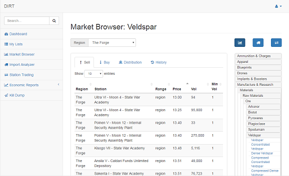
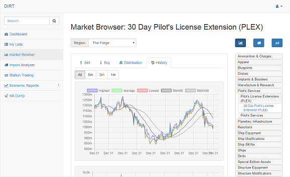
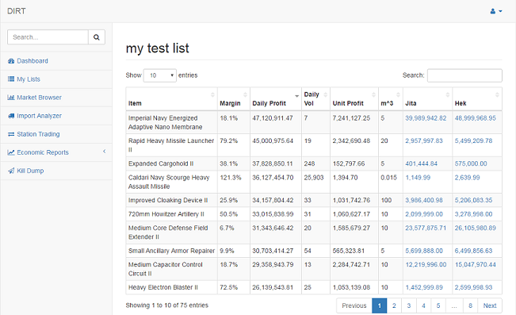
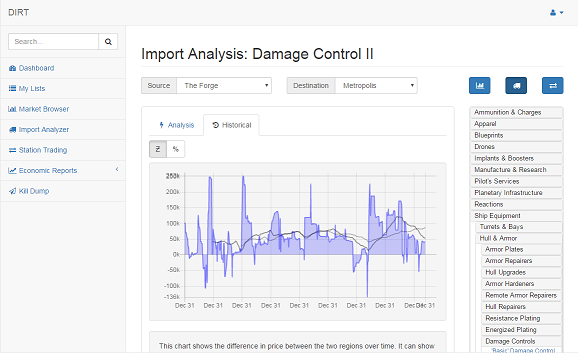
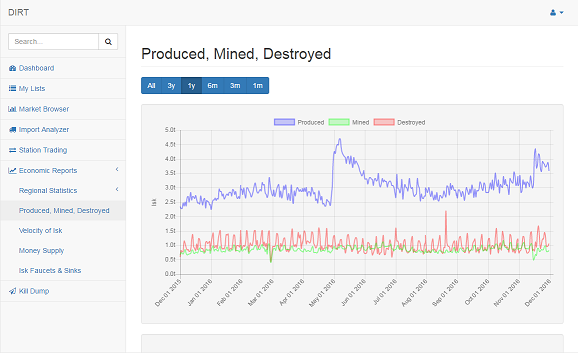

# DIRT
Market analysis and trading tools for EVE Online.

## Motivation
This project emerged out of my interests in the video game Eve Online by CCP Games. In-game, I have made nearly all of my fortune as a trader in the backwater market hub of Hek in the Metropolis region. My methods involved a number of other tools by other 3rd party developers and a host of complex spreadsheets to identify and exploit profitable trades. By (finally) building this application, I can now perform all those same functions (and more) in a more streamlined fashion.

What made this project so exciting was the sheer wealth of live data that CCP Games provides out-of-game through their APIs. In addition, some of my very first experiences with software development were with self-taught HTML/CSS/JS in the era of Geocities. This project was a nostalgic dive back into the world of web development and all the new technologies that have matured since my beginnings.

## Industry, Trade, and Explosions
DIRT is an unfinished backronym involving Inter-Regional Trade. There are many 'careers' in Eve Online, but I seem to have settled into the world of trading on the marketplace, specifically importing items from other regions for resale. My love of math and the rich prospect analyzing large datasets further pushed my enthusiasm to find better and better ways to make isk (the game currency).

DIRT implements basic trading necessities such as viewing the live order book for an item in a region:

As well as veiwing the historical prices with simple indicators:

The heart of DIRT is the list system which allows you add/remove items as you discover them and track their profitability. A work-in-progress feature using complex SQL queries will soon allow for the massive analysis of all 15,000+ item types across all 5 hub regions to help search and filter out the absolute best things to trade.

The import analyzer gives statistics on the business of importing items from other regions for resale, including an simulated historical performance to assess the long-term stability of importing that item:

My original probe into how to use the chart.js library and a desire for a more in-depth view of CCP's Monthly Economic Report data led to the inclusion of interactive charts for that data, going beyond the static images that CCP publishes:

## The Code
I have gone through several iterations of various projects with the intent of building a trade analysis tool, but only this iteration finally encompasses the full breadth of my ideas. I originally chose node.js as the technology with which to build this application, but after learning and using the asynchronous style of coding, I found it was much easier and appropriate to use a standard Apache-MySQL-PHP stack with AJAX to implement the frontend features.

The backend code which scrapes CCP's APIs is currently written in Java, but may some day be converted to Python.

## The Future
After the core features such as import analysis, station trading, the list system, and basic account management are sufficiently implemented, I hope to build further tools for activities such as identifying market manipulation, kill mail analysis, and automated trade searches.

## License
This project is not yet released for public use. It will likely be released under the MIT License if/when the time comes.
